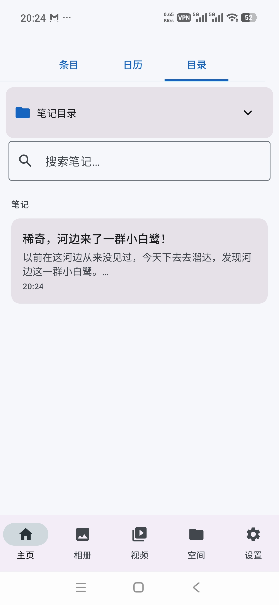
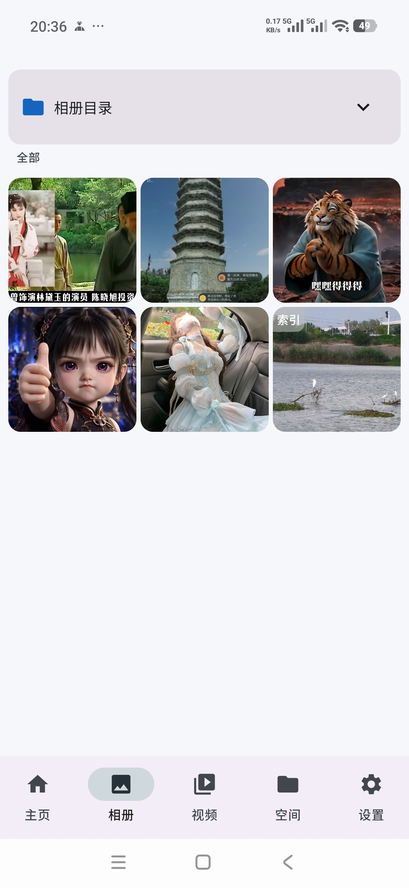
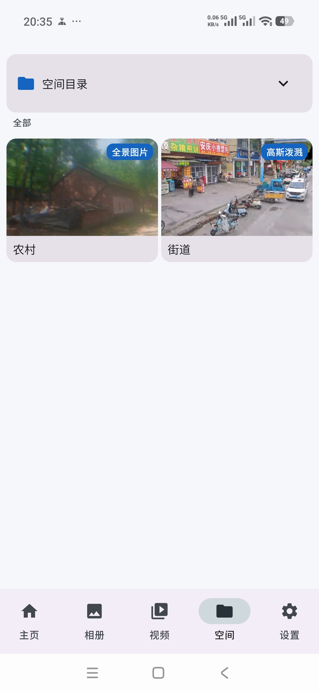
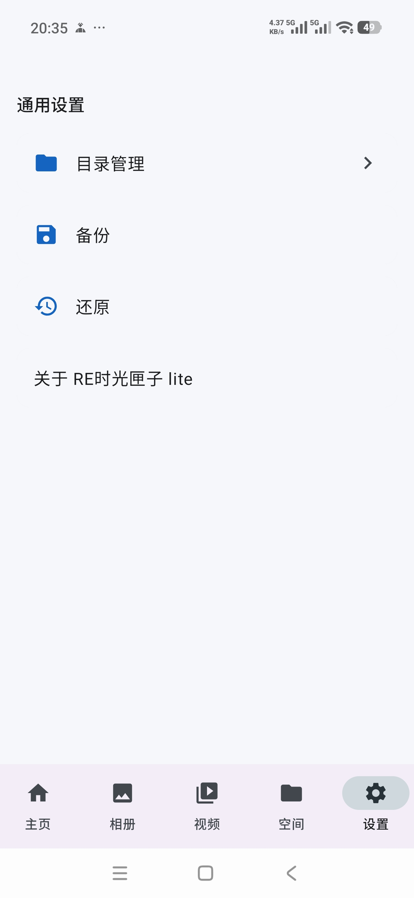

# RE时光匣子 Lite

一款记录记忆的app，用来记录人生中的各种记忆，支持各种方式记录，比如：文字、语音、图片、视频、高斯泼溅等方式。

由于作者并不是专门做编程的人员，只是普通人员用AI简单写了个lite，普通人员用AI写简单应用可以，但不适合写复杂的应用，会特别麻烦和折腾，复杂度难度极高，应用目前只能做成这样，lite 版只是一个简单轻量版本，lite版完成的是基础轻量功能，并非足够好的完整版本，有感兴趣的人或公司可以考虑开发这款应用的完整版。

基于 Jetpack Compose 开发的 Android 应用。

## 截图展示
<div align="center">




</div>

## 功能特性

### 📝 笔记管理
- 支持富文本 Markdown 格式记录
- 按日期组织笔记（条目视图、日历视图、目录视图）
- 笔记关联多个文件夹，支持目录层级结构
- 插入图片、视频、语音、空间链接等多媒体内容
- 笔记搜索功能

### 🖼️ 媒体管理
- 相册：统一管理应用内所有图片资源
- 视频：视频播放与管理
- 批量选择、删除、移动等操作
- 支持从系统相册/文件管理器导入

### 🌐 空间链接
- 支持三种空间内容类型：
  - **全景图片**（Panorama Image）
  - **全景视频**（Panorama Video）
  - **高斯泼溅**（Gaussian Splatting / 3D GS）
- 缩略图预览，支持上传本地图片作为缩略图
- 使用腾讯 TBS X5 浏览器引擎渲染全景内容
- 可在空间页面统一管理，也可嵌入笔记中

### 📁 文件夹管理
- 多级文件夹层级结构
- 支持新建、重命名、删除、移动
- 文件夹主题色自定义

### 💾 数据备份
- 将所有数据（笔记、媒体、空间链接）打包为 ZIP 进行备份
- 支持从备份 ZIP 还原数据
- 备份文件可脱离应用，方便迁移和转换

## 技术栈

| 类别 | 技术 | 版本 |
|------|------|------|
| **语言** | Kotlin | - |
| **最低 SDK** | Android 10 (API 29) | - |
| **目标 SDK** | Android 15 (API 35) | - |
| **UI 框架** | Jetpack Compose + Material 3 | Compose BOM 2024.10.01 |
| **数据库** | Room | 2.6.1 |
| **导航** | Navigation Compose | 2.8.0 |
| **图片加载** | Coil | 2.7.0 |
| **媒体播放** | Media3 (ExoPlayer) | 1.3.1 |
| **全景渲染** | 腾讯 TBS X5 SDK | 44286 |
| **序列化** | Gson | 2.11.0 |
| **富文本编辑** | RichEditor-Compose | 1.0.0-rc11 |
| **协程** | Kotlin Coroutines | 1.9.0 |
| **持久化** | DataStore Preferences | 1.1.1 |

## 项目结构

```
app/src/main/java/com/retimebox/lite/
├── data/
│   ├── local/
│   │   ├── AppDatabase.kt       # Room 数据库定义
│   │   ├── converter/           # 类型转换器（List<Long>、ContentReference 等）
│   │   ├── dao/                 # 数据访问对象（FolderDao、RecordDao 等）
│   │   └── entity/              # 数据库实体（Folder、Record、MediaItem、SpaceLinkItem）
│   └── repository/              # 数据仓库层
├── ui/
│   ├── album/                   # 相册页面
│   ├── components/              # 通用组件
│   ├── folder/                  # 文件夹选择器
│   ├── home/                    # 主页（条目/日历/目录视图）
│   ├── media/                   # 媒体预览（图片/视频）
│   ├── navigation/             # 导航路由定义
│   ├── record/                  # 笔记详情/编辑
│   ├── settings/                # 设置/文件夹管理
│   ├── space/                   # 空间页面（空间链接管理）
│   ├── spacelink/               # 空间链接 WebView
│   ├── theme/                   # 主题配置（Color、Theme）
│   └── video/                   # 视频页面
├── util/
│   ├── BackupRestoreManager.kt  # 备份/还原管理
│   ├── FileHelper.kt            # 文件操作工具
│   └── RichEditorHelper.kt      # 富文本辅助
├── viewmodel/                   # ViewModel 层
│   ├── HomeViewModel.kt
│   ├── RecordEditorViewModel.kt
│   ├── RecordDetailViewModel.kt
│   ├── SpaceViewModel.kt
│   ├── AlbumViewModel.kt
│   ├── VideoViewModel.kt
│   └── SettingsViewModel.kt
├── MainActivity.kt
└── RetimeboxApplication.kt
```

## 数据模型

### Folder（文件夹）
| 字段 | 类型 | 说明 |
|------|------|------|
| id | Long | 主键，自增 |
| folderName | String | 文件夹名称 |
| parentId | Long? | 父文件夹 ID |
| color | String? | 主题色 |
| createTime | Long | 创建时间戳 |
| updateTime | Long | 更新时间戳 |

### Record（笔记）
| 字段 | 类型 | 说明 |
|------|------|------|
| id | Long | 主键，自增 |
| recordDate | Long | 笔记日期 |
| title | String | 标题 |
| contentMarkdown | String | Markdown 格式内容 |
| contentReferenceIds | List<ContentReference> | 关联的媒体/空间内容引用 |
| relatedFolderIds | List<Long> | 关联的文件夹 ID 列表 |
| primaryFolderId | Long? | 主文件夹 ID |
| createTime | Long | 创建时间戳 |
| updateTime | Long | 更新时间戳 |

### MediaItem（媒体项）
支持类型：`IMAGE`、`VIDEO`、`VOICE`

### SpaceLinkItem（空间链接）
| 字段 | 类型 | 说明 |
|------|------|------|
| id | Long | 主键，自增 |
| spaceType | SpaceType | 类型：PANORAMA_IMAGE / PANORAMA_VIDEO / GSPLAT |
| webUrl | String | 网页链接地址 |
| name | String | 链接名称 |
| thumbnailUrl | String? | 缩略图相对路径 |
| sourceType | SourceType | 来源类型 |
| bindRecordId | Long? | 绑定的笔记 ID（级联删除） |
| folderId | Long | 所属文件夹 |
| createTime | Long | 创建时间戳 |

## 存储结构

应用数据存储路径：`/storage/emulated/0/Android/data/com.retimebox.lite/retimeboxlitefiles/`

```
retimeboxlitefiles/
├── image/                        # 图片目录
│   └── {year}/
│       ├── thumbnails/           # 缩略图目录
│       └── *.jpg                 # 原始图片
├── video/                        # 视频目录
├── voice/                        # 语音目录
├── spurl/                        # 空间链接相关
├── md/                           # Markdown 笔记文件
└── db/                           # 数据库文件
    └── retimebox_lite.db
```

## 权限需求

| 权限 | 用途 |
|------|------|
| `INTERNET` | 空间链接 WebView 访问 |
| `ACCESS_NETWORK_STATE` | 网络状态检测 |
| `RECORD_AUDIO` | 语音录制 |
| `READ_MEDIA_IMAGES` | 读取图片（Android 13+） |
| `READ_MEDIA_VIDEO` | 读取视频（Android 13+） |
| `READ_EXTERNAL_STORAGE` | 读取外部存储（Android 12 及以下） |

## 导航路由

| 路由 | 参数 | 说明 |
|------|------|------|
| `home` | — | 主页（底部导航入口） |
| `record/{recordId}` | recordId: Long | 笔记详情页 |
| `record_editor/{recordId}/{folderId}` | recordId: Long?, folderId: Long? | 笔记编辑页（新建/编辑） |
| `image_preview/{imageId}` | imageId: Long | 图片预览页 |
| `video_player/{videoId}` | videoId: Long | 视频播放页 |
| `space_webview/{spaceLinkId}` | spaceLinkId: Long | 空间链接 WebView 页 |
| `folder_manager` | — | 文件夹管理页 |

## 构建与运行

### 环境要求
- JDK 17+
- Android Gradle Plugin 8.x
- Gradle 8.x
- Android Studio 推荐版本（Hedgehog / Iguana / Koala 及以上）

### 构建步骤
1. 克隆项目到本地
2. 使用 Android Studio 打开项目
3. 等待 Gradle 同步完成
4. 连接 Android 设备或启动模拟器（API 29+）
5. 点击 Run 按钮安装调试版本

## 版本历史

- **v1.0.0** — 初始版本
  - 基础笔记编辑功能
  - 多媒体内容管理（图片、视频、语音）
  - 空间链接支持（全景图片/视频/高斯泼溅）
  - 文件夹层级管理
  - 数据备份与还原
